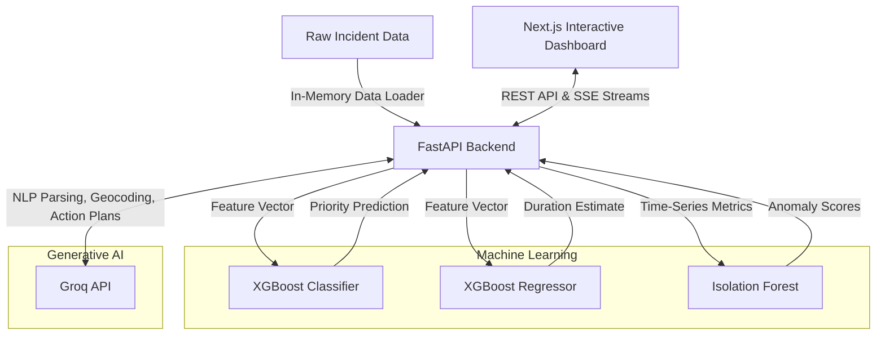
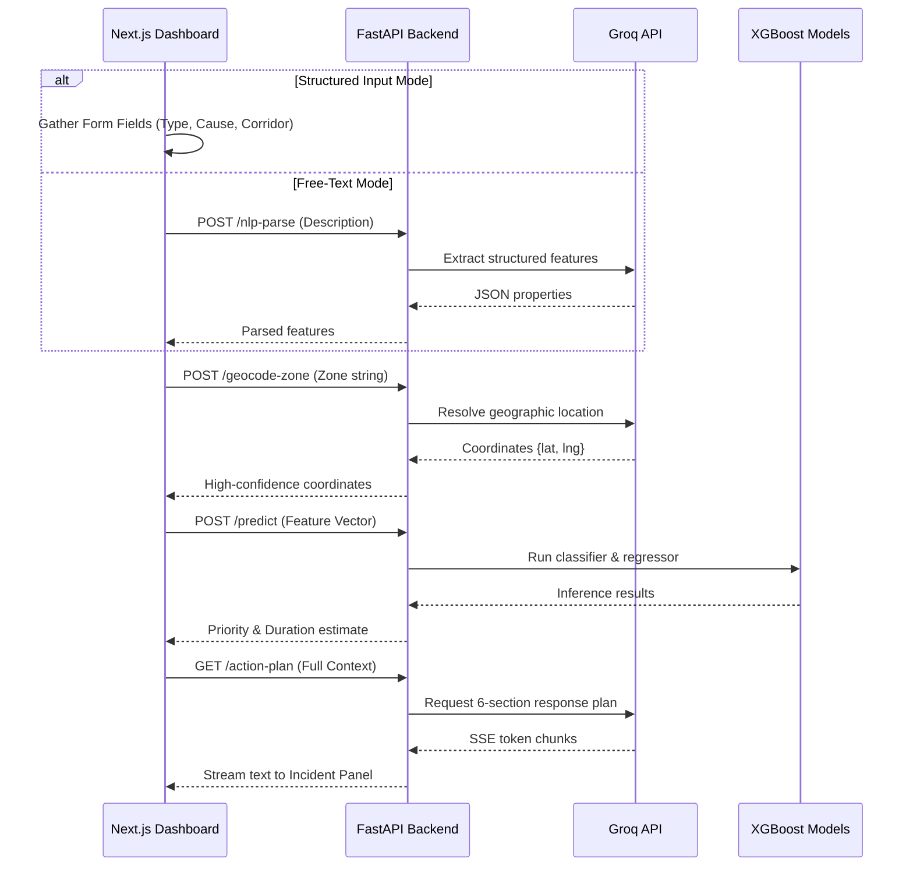
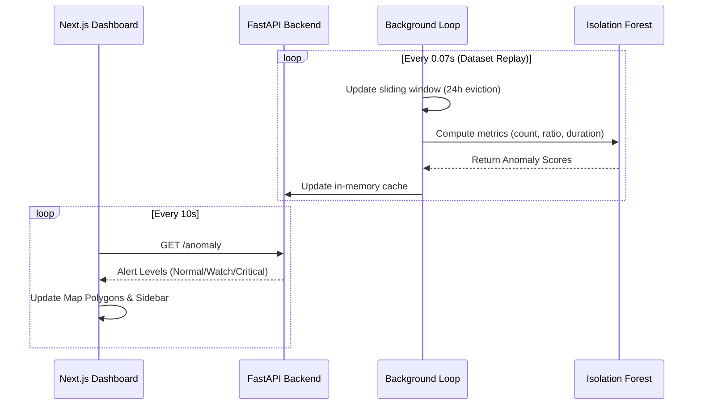
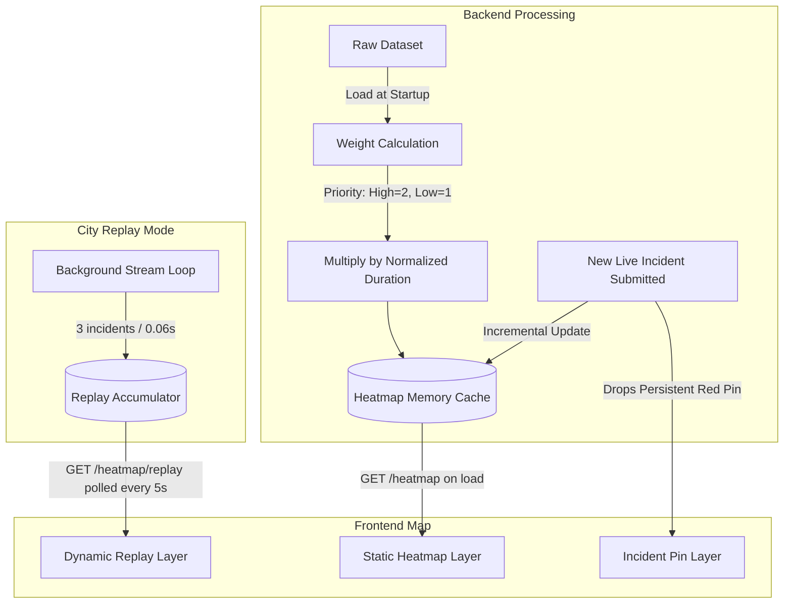

# Smart Traffic Intelligence System

An AI-powered traffic forecasting and decision-support platform built on a dataset of **8,173 real Bengaluru traffic incidents**. It helps authorities predict congestion caused by planned and unplanned events, detect anomalies before they escalate, and auto-generate response plans using Generative AI. By learning the actual congestion behaviors of Bengaluru's unique corridors, the system transitions city operations from reactive to proactive.

## Problem Statement

Traffic authorities today react to congestion after it happens, relying on experience-based decisions, manual patrols, and no post-event learning. This system solves that by utilizing historical city data to anticipate choke points before they form:

*   **Planned events** (public gatherings, construction) are analyzed to predict impact in advance.
*   **Unplanned events** (breakdowns, accidents) trigger early anomaly detection.
*   **Every incident** is processed through GenAI to auto-generate a ready-to-act response plan.

## System Architecture

The architecture relies on a Next.js interactive frontend and a FastAPI backend that handles ML model inference, data processing, and integrations with Large Language Models.

## Data Flow & Operations

### 1. Incident Submission & Prediction Pipeline

When an incident is reported, the system parses the input, resolves the exact geographic location, predicts the severity, and streams a live response plan back to the dashboard.

### 2. Live Anomaly Detection

The system continuously evaluates traffic conditions across city zones to identify anomalous congestion patterns before they escalate.

### 3. Dynamic City Heatmap

The system renders a visual representation of congestion severity. It defaults to a static layer of accumulated historical data, but features a "City Replay" mode that streams dynamic clusters in real-time.

## Core Features

*   **Event-Based Congestion Prediction:** Forecast traffic volume and priority risk scores for any upcoming or ongoing event.
*   **Multilingual Incident Understanding:** Automatically classify Kannada or mixed-language incident reports using NLP to extract actionable structured data.
*   **GenAI Action Planner:** LLM-generated deployment plans specifying required officers, barricades, diversions, escalation triggers, and public advisories.
*   **Dynamic Congestion Heatmap:** Real-time city replay map visualization of historical and streaming congestion zones.
*   **Pre-emptive Anomaly Detection:** Detect unexpected traffic surges on a zone-by-zone basis.
*   **AI Geocoding:** Dynamically resolve ambiguous or free-text area names into precise geographic coordinates.

## Machine Learning Integration

*   **Traffic Prediction Models:** XGBoost Classifier and Regressor models predicting priority (High/Low) and estimated resolution time (in minutes). Inputs include location, corridor frequency, time-of-day, zone, and incident cause.
*   **Anomaly Detection:** Isolation Forest model monitoring unexpected congestion surges and unplanned disruptions, outputting alert severity scores.

## Technology Stack

### Frontend
*   **Next.js 16**
*   **TypeScript**
*   **Tailwind CSS**
*   **Leaflet.js** (Interactive mapping and heatmaps)
*   **Recharts** (Analytics and data visualization)

### Backend
*   **Python 3**
*   **FastAPI** (REST API, Server-Sent Events, background tasks)
*   **AsyncIO**

### Machine Learning & Data Processing
*   **Scikit-learn** (Preprocessing, Isolation Forest)
*   **XGBoost** (Classification and regression models)
*   **Pandas / NumPy** (In-memory data processing and feature engineering)

### Generative AI
*   **Groq API** (NLP extraction, geocoding resolution, and action plan generation)

## Dashboard Views

1.  **Map View:** Full-screen Leaflet map displaying a historical or streaming heatmap, anomaly zone polygons, and a real-time alert sidebar.
2.  **Submit Incident:** An intuitive form supporting both structured inputs and free-text NLP processing to simulate or report live incidents.
3.  **Analytics:** Historical data charts displaying hourly volume profiles, a leaderboard of high-risk junctions, and planned versus unplanned monthly trends.

All user interactions funnel into a shared **Incident Panel** drawer that displays predictions, streams the LLM-generated action plans, and collects user feedback.

## Dataset Information

The system is built on a real Bengaluru traffic incident dataset containing 8,173 records. The data includes both planned and unplanned events, specific causes, corridor rankings, multilingual descriptions, and zone/junction metadata.
